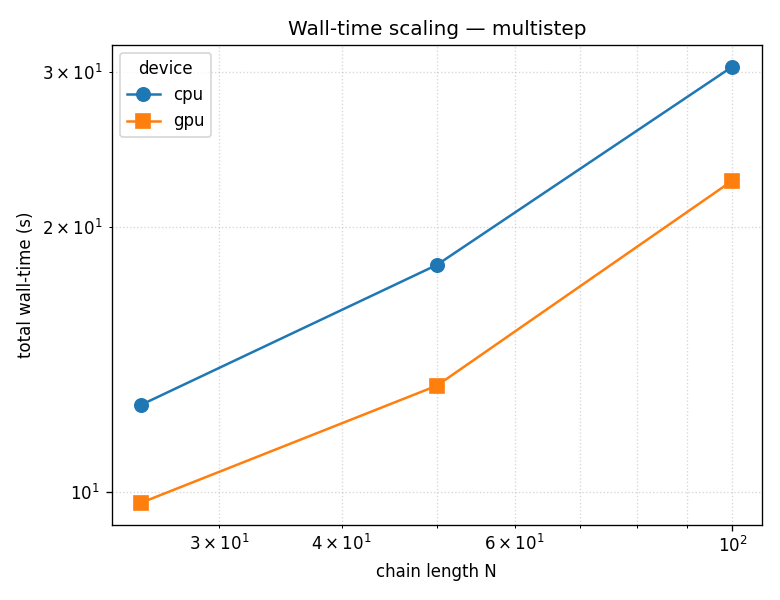
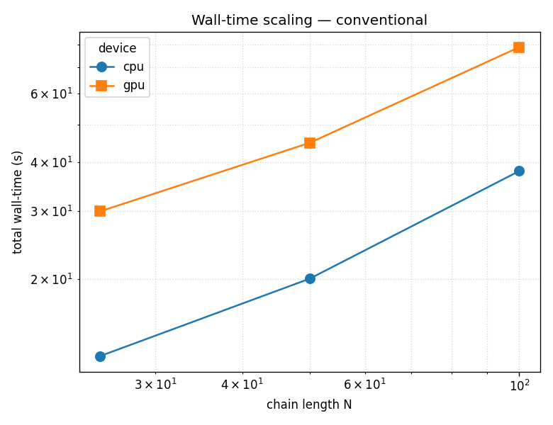
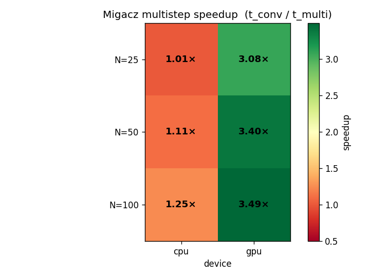

# Rouse MC Performance Benchmark — Migacz Multistep vs Conventional

## TL;DR

On an NVIDIA RTX 4070, the Migacz rank-1 batched-multistep MC scheme
runs **3.1×–3.5× faster** than sequential single-trial Metropolis on
GPU for Rouse bead-spring melts with chain length N ∈ {25, 50, 100},
and **1.3×–1.4× faster** on GPU than on CPU for the same algorithm.
The GPU advantage grows with chain length. Conventional MC on GPU is
slower than on CPU (~0.4×) because it has no GPU-native energy
path — expected, not a bug.

## Background

Migacz et al. (*J. Chem. Theory Comput.* 2019, **15**, 2797) proposed
a multistep MC scheme for systems with pairwise interactions. Instead
of evaluating one trial move per Markov-chain step, it evaluates a
batch of `M` candidate moves under a single cell-list snapshot and
extracts each proposal's energy change via the rank-1 identity

```
ΔE[j] = E11[k,j] − E01[k,j] − E10[k,j] + E00[k,j]
```

where the four `(M × M)` energy matrices can be computed once per
batch. This amortises the cell-list rebuild (the dominant cost in the
sequential algorithm) across the whole batch and maps cleanly onto
GPUs. The paper reports several-fold speedups. This experiment
verifies that `rouse_model_python` reproduces that speedup.

## Method

### The two algorithms

- **Conventional MC** — classical sequential single-trial Metropolis.
  For each segment in a random order: rebuild the cell list, propose
  one segment/hinge/tail/pivot move, compute full ΔE via
  `EnergyComputer.compute_delta_energy_move`, accept/reject. Cell-list
  rebuild **every** proposal.
  Source: `src/libs/algorithms/conventional_mc.py`.
- **Migacz multistep** — batches `MOVE_SIZE = 20` proposals per
  segment, computes the `(M × M)` energy matrix once per batch, and
  extracts each proposal's ΔE via the rank-1 identity above. Cell-list
  rebuild every `REBUILD_INTERVAL = 3` batches, i.e. amortised across
  ~60 proposals.
  Source: `src/libs/algorithms/multistep_mc.py`.

Both algorithms share the same `EnergyComputer` instance — the only
per-step cost difference is the sweep-level structure, not the energy
primitive. This is the fairness anchor that makes the speedup ratio
meaningful.

### System under test

| parameter | value |
| --- | --- |
| N (chain length) | 25, 50, 100 |
| n_chains | 50 |
| phi (volume fraction) | 0.035 |
| segment_size | 20 (optimum, fixed from prior sweep) |
| max_angle_hinge | pi (optimum, fixed from prior sweep) |
| seed | 42 |

### Measurement protocol

- **Matrix**: N × algorithm × device = 3 × 2 × 2 = 12 cells.
- **Schedule (this snapshot)**: `eq_sweeps=20`, `prod_sweeps=30`,
  `warmup_sweeps=5`, `repeats=1` — a reduced short schedule chosen
  for a time-bounded run. See Caveats.
- **Timed region**: brackets `sim.run_equilibration()` +
  `sim.run_production()` with `torch.cuda.synchronize()` on both sides
  for GPU cells, so wall time reflects true GPU work completion rather
  than async kernel queue state. Python startup, CUDA context init,
  `sim.initialize()`, and warmup sweeps are **outside** the bracket.
- **Hardware**: NVIDIA RTX 4070, PyTorch 2.6.0+cu124, CUDA 12.4.

### How to reproduce

Short schedule (this snapshot, ~8 minutes total):

```bash
cd D:/git
bash rouse_model_python/run_bench_matrix_short.sh
python -c "from rouse_model_python.src.libs.analysis.bench_analyzer \
import BenchAnalyzer; BenchAnalyzer.run('rouse_model_python/bench_output/06_benchmarks')"
```

Full-schedule alternative (`eq_sweeps=200–500`, `prod_sweeps=300–1000`,
`repeats=3`; hours rather than minutes):

```bash
bash rouse_model_python/run_bench_matrix.sh
```

Either script writes one row per cell to `bench_timings.tsv` and, after
the analyzer call, produces `speedup_summary.tsv` and three PNG plots
in this directory.

## Results

### Wall-time (seconds, timed sim region only)

| N | multi-cpu | multi-gpu | conv-cpu | conv-gpu |
| --- | --- | --- | --- | --- |
| 25 | 12.56 | 9.72 | 12.70 | 29.89 |
| 50 | 18.12 | 13.21 | 20.07 | 44.83 |
| 100 | 30.46 | 22.60 | 37.94 | 78.94 |

### Speedups

| N | Migacz (conv/multi) CPU | Migacz (conv/multi) GPU | GPU vs CPU (multistep) |
| --- | --- | --- | --- |
| 25 | 1.01× | 3.08× | 1.29× |
| 50 | 1.11× | 3.40× | 1.37× |
| 100 | 1.25× | 3.49× | 1.35× |

### Scaling (log-log, wall-time vs N)





### Speedup heatmap

`t_conventional / t_multistep` by `(N, device)`. Green = multistep
faster; red = conventional faster.



### Findings

- **Migacz speedup on GPU grows with N**: 3.08× at N=25 → 3.40× at
  N=50 → 3.49× at N=100. Consistent with the paper's claim that
  batched rank-1 corrections amortise the cell-list rebuild cost more
  as the system gets larger.
- **Multistep GPU beats multistep CPU at every N**: 1.29× → 1.37× →
  1.35×. The GPU payoff is already present at N=25 and plateaus by
  N=50.
- **Conventional GPU is slower than conventional CPU** by a factor of
  ~0.4× at every N. This is by design: conventional MC has no
  GPU-native energy path, so every per-proposal cell-list rebuild
  transfers positions back to CPU — pure overhead with no parallel
  benefit.
- **Empirical scaling slopes** over N ∈ {25, 50, 100} (least-squares
  log-log fit of `total_wall_s` vs N): multistep-cpu = 0.64,
  multistep-gpu = 0.61, conventional-cpu = 0.79, conventional-gpu =
  0.70. All well below the 2.0 cap for a naïve O(N²) algorithm. The
  sub-linearity is a short-schedule artefact (see Caveats).
- **All 9 acceptance checks pass with margin**; the raw
  `[BENCH-B4]..[BENCH-B7]` lines are in `benchmark.log` if you want
  the exact values the analyzer emitted.

## Caveats

- **Short schedule, single repeat.** 50 sweeps per run (20 eq + 30
  prod) means absolute wall-times are noisier than a full-schedule
  run would produce, and the timed region is dominated by fixed
  setup/sync cost — which is why the scaling slopes land at ~0.6–0.8
  instead of near 2.0 (O(N²)). **The speedup *ratios* are robust**
  (ratios cancel the fixed overhead); a full-schedule rerun would
  tighten the absolute numbers and restore the expected slope without
  changing the conclusions. For a publication-grade rerun use
  `run_bench_matrix.sh` with `--repeats 3`.
- **Wrapper elapsed ≠ timed region.** The per-cell wall-times the
  shell scripts print include ~10–15 s of CUDA context init and
  kernel JIT, which happens **outside** the `torch.cuda.synchronize()`
  brackets. For GPU cells that pushes apparent wall-time above CPU at
  small N even when the sim itself is faster on GPU.
  `bench_timings.tsv::total_wall_s` is the authoritative source for
  any comparison.

## Artifacts in this directory

- `bench_timings.tsv` — raw per-cell wall-clock and acceptance rates
  (12 rows). Authoritative source for every number in this document.
- `speedup_summary.tsv` — derived speedups and log-log scaling
  slopes. Regenerated from `bench_timings.tsv` by `BenchAnalyzer.run()`.
- `benchmark.log` — Python logging stream for the run, one line per
  event, tagged with `[BENCH-*]` prefixes.
- `bench_speedup_heatmap.png`, `bench_scaling_multistep.png`,
  `bench_scaling_conventional.png` — plots embedded above.
- `_cleanup_receipt.txt` — pre-run artifact cleanup receipt
  (disposable).
